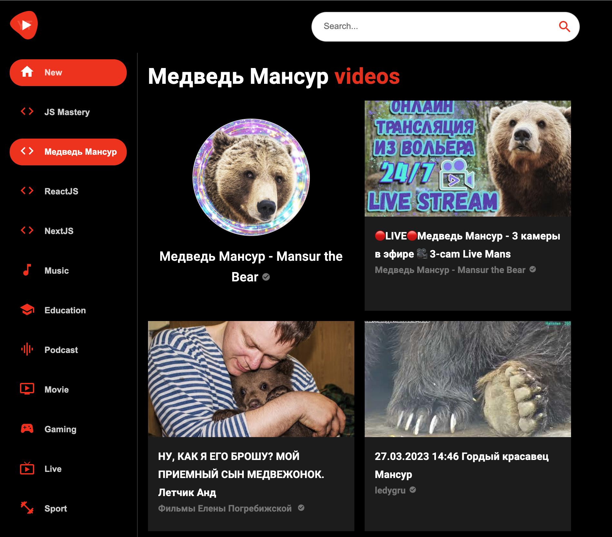

<h1>YouTube-clone-project</h1>

Идея и реализация данного проекта была подсмотренна на самом YouTube.
Проект представляет собой SPA построенную с помощью библиотеки React. 
Ссылка на страницу проекта в шапке проекта.
___

### Реализованный функционал:
+ Возможность поиска любых видео и каналов на YouTube через SearchBar;
+ Настроен роутинг (/channel, /video, /search);
+ Для просмотра видео используется ReactPlayer;
+ Адаптивная верстка.

### Целью данного проекта было:
+ Попробовать Rapid API (Youtube v3);
+ Закрепить навыки использования React Hooks (useState, useEffect);
+ Поработать с react-router-dom;
+ Получить опыт от знакомства с библиотекой Material UI;
+ Деплой с помощью Netlify.

### В планах по доработке:
+ Кастомизировать дизайн и Sidebar под себя;
+ Добавить анимацию.